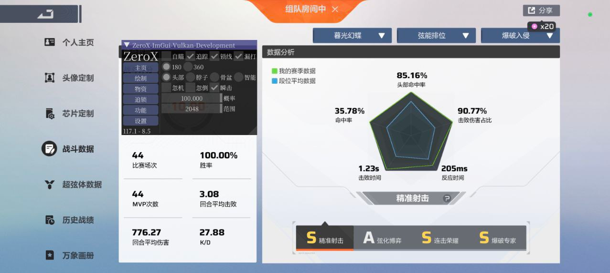

# 卡拉彼丘 ZeroX 公益内核

## 介绍
- 公益卡密：
  - 高能英雄：AYLACB8NX93AA
  - 卡拉彼丘：A815M6CSMC32I
  - 远光84：0815D7KR5PO63
- 使用方法：通过 Lsposed 勾选对应游戏后使用
- 支持游戏（自配防封）：远光84 / 高能英雄 / 卡拉彼丘
- 1.2.9 更新：
  - 卡拉彼丘：更新追踪，支持全枪
  - 新增/优化：无后聚点、自定义广角
  - 适配：2D 纸片人状态骨骼
  - 修复：敌人死亡绘制问题
  - 默认忽略倒地：倒地不进行绘制

## 下载
| 下载     | 网盘链接                                                                 | 提取码 |
| -------- | ------------------------------------------------------------------------ | ------ |
| 迅雷网盘 | https://pan.xunlei.com/s/VOccD1i5J6VqNU56_bnuomtZA1?pwd=e557#            | e557   |
