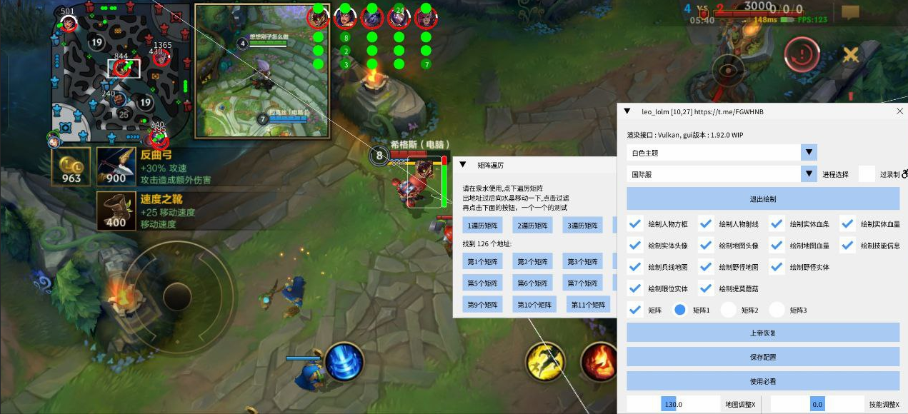

# LOL LEO 公益内核

## 介绍
- 提供“LOL LEO 公益内核”，适用于学习与研究场景
- 不会使用矩阵算法的用户，可点击“使用必看”查看教程
- 重构与优化内容：
  - 新增：上帝视角
  - 优化：绘图效果
  - 增加：提莫蘑菇
- 修复：保存问题

## 下载
| 下载     | 网盘链接                                                                 | 提取码 |
| -------- | ------------------------------------------------------------------------ | ------------ |
| 迅雷网盘 | https://pan.xunlei.com/s/VOccD1i5J6VqNU56_bnuomtZA1?pwd=e557#            | e557         |
